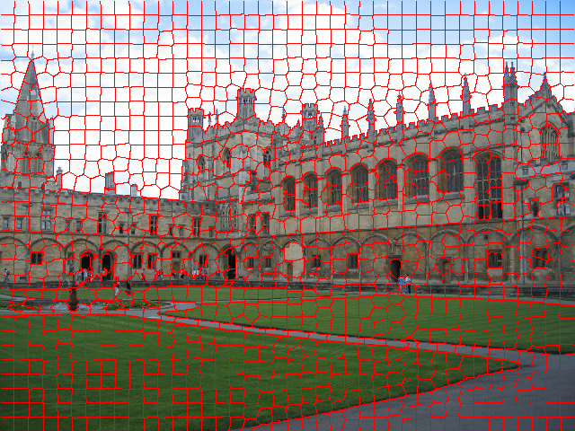

# gSLICr: Real-time super-pixel segmentation software



gSLICr is a library for real-time superpixel segmentation written in C++ and CUDA, authored by [Carl Yuheng Ren](http://carlyuheng.com/).

It is available free for non-commercial use, and may be redistributed under these conditions. For commercial use, please contact [ren@carlyuheng.com](ren@carlyuheng.com).

## Updates from gSLIC
- Fully re-factored code.
- Works for any size / number of super pixels
- With GTX Titan Black, 4.5ms@640x480, 13ms@1280x960, 25ms@1920x1080 image
- Multi-platform supported
  - Win8 Visual Studio 
  - Ubuntu 14.04
  - Mac OSX 10.10

## Requirements:
- CUDA: required
- OpenCV: optional (only if you want to run the demo, opencv is used for reading camera input) 

## To run demo:
- plug in a webcam
```
mkdir build
cd build
cmake ../
make
./demo
```
## Paper to cite:
If you use this code for your research, please kindly cite:
```
@article{gSLIC_2011,
	author = {Carl Yuheng Ren and Ian Reid},
	title = "{gSLIC: a real-time implementation of SLIC superpixel segmentation}",
	journal = {Oxford University Technical Report},
	year = 2011
}
```
(this is a old version of the repot for now, will be updated a bit later)

